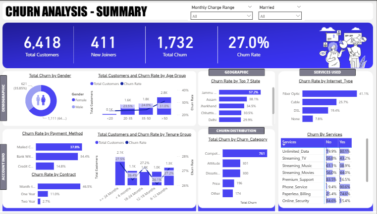

# Telecom-Churn-Analysis-Data-to-Machine-Learning-Model
To uncover the key drivers of customer churn in a telecom dataset and build a predictive model to identify at-risk customers.
Project Overview

This project marks my first complete data analysis journey, where I explored customer churn patterns in a telecom dataset using Power BI, SQL, and Python. The goal was to uncover actionable insights and build a predictive model to help telecom providers retain customers more effectively.

 
📊 [Explore the Kaggle notebook](https://www.kaggle.com/code/darkpsycs/churn-analysis-power-bi-dashboard)

Objective
To analyze customer behavior and identify churn drivers using data visualization and machine learning. The project answers:  
“What factors influence customer churn, and how can telecom companies proactively reduce it?”

Dataset Summary

- Source: Kaggle Telecom Churn Dataset  
- Records: Customer demographics, contract types, billing info, service usage, and churn status  
- Key Features:  
  - Contract Type  
  - Tenure  
  - Monthly Charges  
  - Payment Method  
  - Services Subscribed  
  - Churn Indicator  

Tools & Technologies

- Power BI – Dashboard creation and trend visualization  
- Python – Predictive modeling with Random Forest  
- SQL – Data cleaning and transformation  
- Pandas, Scikit-learn – Data manipulation and machine learning  

Process Breakdown

1. Data Cleaning & Preparation
- Removed duplicates and handled missing values  
- Encoded categorical variables  
- Normalized numerical features  
- Split data into training and test sets  

2. Exploratory Data Analysis
- Identified churn trends across contract types, tenure, payment methods, and service combinations  
- Created visualizations to highlight churn hotspots  

3. Predictive Modeling
- Built a Logistics Regression model to predict churn  
- Evaluated model accuracy and recall  
- Integrated predictions into Power BI dashboard  

📈 Key Insights

-  Month-to-month contracts had the highest churn rates  
- customers around the ages of 50 above have a higher churn rate
- Short-tenure customers were more likely to leave  
- Customers with bundled services (Unlimited data, paperless billing, internet service, phone service) showed higher churn while customers with (premium support, Online security, online backup, device protection plan) showed higher retention 
- mailed check users churned more than credit card users  
- Higher monthly charges correlated with increased churn  

- One other major reason for churn is “Competitor” where competitors offered more data, offered higher download speed, had better devices and made better offer
Jammu & Kashmir state has high records of churn, might be presence of high competitors in the state  
- Logistics Regression model reliably predicted churn risk  (82%)

✅ Recommendations

1. Incentivize Long-Term Contracts
   Offer discounts or perks for longer commitments to reduce churn volatility.

2. Strengthen Onboarding
   Engage new customers early with tutorials, support, and personalized outreach.

3. Promote Service Bundling
   Create attractive packages to increase customer stickiness.

4. Optimize Payment Experience
   Encourage auto-pay methods to reduce friction and improve retention.

5. Reevaluate Pricing Strategy
   Align pricing with perceived value through tiered plans and loyalty benefits.

6. Deploy Predictive Retention Campaigns  
   Use model outputs to proactively support high-risk customers.

7. Monitor & Iterate  
   Continuously track churn metrics in Power BI to adapt strategies in real time.

Dashboard Highlights

- Churn by Contract Type  
- Total churn by Gender
- Total customers and Churn rate by age group 
- Churn rate by Top 7 states
- Churn rate by internet type
- Churn rate by payment method 
- Total customers and churn rate by tenure group
- Total churn by churn category
- Churn by servicesl 
- Predictive Model Output  

Explore the full dashboard on [Kaggle](https://www.kaggle.com/code/darkpsycs/churn-analysis-power-bi-dashboard)

Conclusion

This project helped me understand the full lifecycle of data analysis—from cleaning and exploration to modeling and storytelling. It’s a milestone in my journey, and I’m excited to keep building on this foundation.

References

- Dataset: Kaggle Telecom Churn Dataset  
- Tools: SQL, Python, Power BI  
- Author: Chukwuma  
- Year: 2025  
